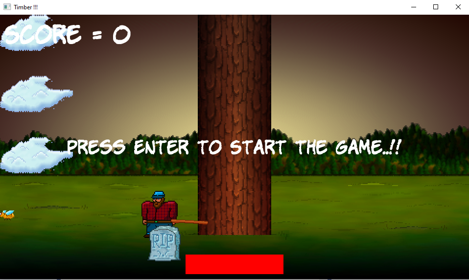
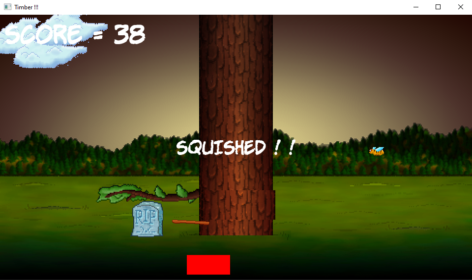
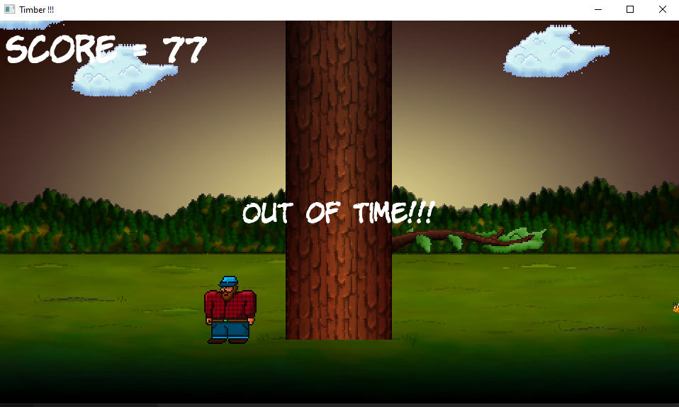

# Timber - A C++/SFML Game

## Description
Timber is a fast-paced arcade-style game where the player must chop down trees while avoiding randomly moving branches. The game is designed to be continuously challenging, as the time is always running out, and players need to make strategic moves before getting hit by the branches.

## Visuals

### Technologies Used
This game is developed using C++ and utilizes the SFML library, demonstrating real-time interaction handling and graphics rendering.

### Project Scope
The project was undertaken as an exercise to understand the fundamentals of game development, focusing on game loop mechanics, event handling, and using multimedia resources in a game environment.

### Personal Learning Outcomes
Through the development of Timber, I have gained practical experience in game programming using C++. It provided me with hands-on experience in graphical software design, and allowed me to implement foundational game design principles using the SFML library.

### Game Mechanics
- **Chopping**: Players can chop at the tree by pressing the left or right arrow key, which triggers the chop animation and the tree-cutting action.
- **Branch Avoidance**: As the player chops down the tree, the branches will come down and the Player must move left or right to avoid being hit by these branches.
- **Timer**: The game includes a countdown timer. Players must perform actions before time runs out to maintain their score streak. The timer runs out fast as the score increases.

### Features
- **Dynamic Obstacles**: Branch patterns are randomly generated, ensuring that no two games are the same, which increases replayability.
- **Scoring System**: Points are awarded based on speed and accuracy of the tree chopping.
- **Adaptive Difficulty**: The game's difficulty increases as the player's score increases, with time bar running out faster.

### Roadmap for Future Updates
- **Frame Rate Display**: Adding an on-screen frame rate.
- **"Start Your Game Prompt"**: Implementing a start screen that instructs players to press the left or right arrow key to begin playing.
- **Asset Management App**: Developing a separate application using Qt and JSON configuration files to allow users to customize game sprites. This app will be linked here once completed.
- **Additional Levels**: Planning to introduce more complex levels with varying environmental challenges.
- **Leaderboard**: Implementing a leaderboard to record high scores.

### Project Status
- **Current Version**: 1.0.0
- **Frame Rate**:  In Progress
- **Start Game Prompt**: Not Started
- **Asset Manager**: In Progress
- **Leaderboard** - Not Started

## License
This project is licensed under the MIT License - see the [LICENSE.md](LICENSE) file for details
